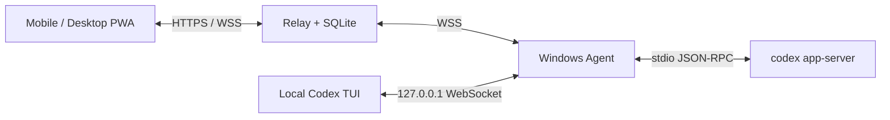

# Codex Control

[简体中文](README.md) | [English](README.en.md)

View, create, and control Codex sessions managed by a Windows Agent from your phone or another computer. Codex Control is a self-hosted control plane with a standalone Windows Agent, a Relay service, and a browser PWA. It integrates with Codex through the public `codex app-server` JSON-RPC interface.

The publishing and default push destination is [yuanx0227/CodexControl](https://github.com/yuanx0227/CodexControl) on **GitHub.com**.

## Features

- **Remote sessions**: browse real history by project and recent activity; create or resume sessions in existing working directories.
- **Live interaction**: streamed responses, execution status, Markdown, controlled local image thumbnails, Turn duration, and execution summaries.
- **Concurrent sessions**: run different sessions concurrently and steer, interrupt, or handle approvals for each session.
- **Runtime options**: select a model from Codex's current model list and choose an approval policy for the next Turn.
- **Windows Agent**: system tray, settings, QR pairing, local `codex --remote` terminal, and discovery of CLI / bundled Desktop runtimes.
- **Mobile and desktop browsers**: React/Vite PWA with a mobile drawer, desktop sidebar, and multiple tabs sharing one identity.
- **Self-hosted deployment**: .NET 8 Relay, SQLite / EF Core migrations, Docker Compose, and nginx HTTPS/WSS.
- **Identity and pairing**: DPAPI device keys, Web Crypto controller keys, one-time pairing codes, local confirmation, and signed challenge authentication.

## Requirements

| Purpose | Requirements |
| --- | --- |
| Windows Agent | Windows 10/11 x64, .NET 8 Desktop Runtime and ASP.NET Core Runtime |
| Codex runtime | A configured Codex CLI or Codex Desktop; the runtime must support `app-server --listen stdio://` and `--remote` |
| Source builds | .NET 8 SDK or a newer SDK that can build .NET 8, Node.js 24, PowerShell 7 |
| Installer packaging | Inno Setup 6 |
| Relay / PWA deployment | Docker and Docker Compose; a production domain and trusted TLS certificate |

The Agent is published as a framework-dependent application. The .NET SDK used for development supplies the required runtimes; installed builds also require the .NET 8 runtimes listed above.

## Get the source

```powershell
git clone https://github.com/yuanx0227/CodexControl.git
Set-Location '.\CodexControl'
```

## Architecture and session boundaries



The Agent runs its own `codex app-server`. Sessions created or resumed through the Agent support live events and remote control. Each session allows one active Turn at a time; different sessions can run concurrently.

Native Codex Desktop sessions support history reads on demand, but the independent Agent cannot subscribe to live events inside another Desktop process. The PWA identifies these external sessions; this project does not provide a shared live connection to Desktop's current session. It does not scrape UI, simulate input, use private interfaces, or read or host the user's OpenAI API Key / private endpoint credentials. Existing model provider and endpoint settings are preserved.

## Local development quick start

Run these commands in PowerShell 7. Use a separate terminal for each component, starting at the repository root.

### 1. Start the Relay

```powershell
$env:ASPNETCORE_ENVIRONMENT = 'Development'
$env:CODEX_CONTROL_DB = Join-Path $env:LOCALAPPDATA 'CodexControl\dev-relay.db'
$env:CODEX_CONTROL_PAIRING_SECRET = [Convert]::ToHexString([System.Security.Cryptography.RandomNumberGenerator]::GetBytes(32))
$env:CODEX_CONTROL_ALLOWED_ORIGINS = 'http://127.0.0.1:5173'

dotnet run --project '.\src\relay\CodexControl.Relay.csproj' -- --urls http://127.0.0.1:5080
```

### 2. Start the PWA

```powershell
Set-Location '.\src\web'
npm ci
npm run dev
```

Open `http://127.0.0.1:5173`. For a manual connection, use `ws://127.0.0.1:5080/ws/controller`. This mode supports development on one computer; phones and other computers should use the HTTPS/WSS deployment below.

### 3. Start the Windows Agent and pair

```powershell
dotnet run --project '.\src\agent\CodexControl.Agent.csproj'
```

Alternatively, start an existing release build:

```powershell
& '.\out\release\agent-win-x64\CodexControlAgent.exe'
```

1. In Agent settings, enter the Relay root URL `http://127.0.0.1:5080` and a computer name.
2. Generate a pairing code, then enter the six-digit code in the PWA or scan the QR code.
3. Confirm the request on Windows and select full control, view only, or deny.
4. Once paired, select a device and session in the PWA. New sessions require an existing absolute working directory on that computer.

Pairing codes expire after 180 seconds, are consumed by the first valid claim, and allow at most five invalid proof attempts. Local confirmation has a 60-second window. A claim alone does not grant control permission.

The Agent prefers Codex CLI on PATH and can discover and stage the matching bundled Codex Desktop runtime. Settings, DPAPI identity, logs, and runtime caches live in `data\` beside the EXE. The default installation directory is `%LOCALAPPDATA%\Programs\CodexControl`. The local TUI entry point uses the loopback port selected by the Agent. A headless entry point is available through `CodexControlAgent.exe --headless [options]`.

Once paired, the PWA can read Codex history and current model options without first opening a local TUI. Projects use public project metadata when available, with working-directory grouping as a fallback. Recent tasks are ordered by `recencyAt`. Agent-managed sessions consume live domain events, followed by one bounded history reconciliation after each Turn completes. External Desktop sessions read history when explicitly opened or refreshed.

## Docker deployment

Production requires a trusted TLS certificate, a random pairing secret, and an explicit allowlist of PWA origins.

```powershell
Set-Location '.\deploy'
Copy-Item '.env.example' '.env'
# Edit .env: set a random CODEX_CONTROL_PAIRING_SECRET, PWA origins, and ports.
# Place TLS certificates at certs/fullchain.pem and certs/privkey.pem.
docker compose up -d --build
```

nginx exposes HTTPS/WSS. Relay and PWA containers use the internal network, and SQLite is stored in the `relay-data` named volume. Set the Agent's Relay root URL to the HTTPS endpoint and open the site on your phone to pair.

For packaged deployments, `tools/Build-Release.ps1` produces Relay, Web, and deployment artifacts that can be built with `deploy/docker-compose.artifacts.yml`. Preserve `.env`, certificates, and the SQLite volume across upgrades; keep runtime data out of Git and release archives.

For local HTTPS development, run `& '.\generate-dev-cert.ps1'` from the `deploy` directory in PowerShell 7 to generate a self-signed certificate. See [the development guide](docs/development.md) for full configuration and operations.

## Build, test, and package

```powershell
dotnet run --project '.\tests\CodexControl.Agent.Tests\CodexControl.Agent.Tests.csproj'
dotnet run --project '.\tests\CodexControl.Relay.Tests\CodexControl.Relay.Tests.csproj'

Push-Location '.\src\web'
try {
    npm ci
    npx playwright install webkit
    npm run build
    npm test
}
finally {
    Pop-Location
}

& '.\tools\Build-Release.ps1'
```

Artifacts are written to `out/release/`, including `agent-win-x64/`, `installer/`, `relay/`, `web/`, and `deploy/`. Without signing configuration, the installer is named `CodexControl-Setup-UNSIGNED.exe`. If a running Agent is using the default release directory, choose a separate output directory, for example `& '.\tools\Build-Release.ps1' -OutputRoot 'out\release-github'`.

Real Codex Turn / Approval tests require explicit `CODEX_CONTROL_REAL_CODEX_PATH` and `CODEX_CONTROL_RUN_REAL_TURNS=1` settings; see [development.md](docs/development.md). Build, simulation, browser, and historical acceptance evidence in this repository does not replace acceptance for the current Codex version, physical phones, multiple computers, or production networks.

## Security design

- Devices use ECDSA P-256; Windows Current User DPAPI encrypts private keys at rest.
- Controller private keys are stored in IndexedDB as non-exportable Web Crypto `CryptoKey` objects.
- SQLite stores only pairing-code HMACs computed with the server secret; persistent connections authenticate through a challenge and signature, with replay protection.
- All remote controls check current pairing permissions. Approvals require an explicit response, and the first valid response wins.
- Remote session creation and resumption enforce `workspace-write`. Approval policies are limited to `untrusted`, `on-request`, and `never`, with `untrusted` as the default.
- The local Codex Proxy binds only to `127.0.0.1`; production Relay transport uses HTTPS/WSS.
- The Relay does not persist complete prompts, assistant responses, shell output, diffs, source code, or raw JSON-RPC history.

See [security.md](docs/security.md) for the full trust model.

## Repository layout and documentation

```text
src/agent/   Windows Agent, app-server bridge, local proxy, and Relay client
src/shared/  Shared protocol contracts and cryptographic encoding
src/relay/   ASP.NET Core Relay, auth, pairing, routing, and SQLite migrations
src/web/     React/Vite PWA and Playwright tests
tests/       Agent, Relay, browser system host, and soak tests
deploy/      Docker Compose, nginx, and certificate scripts
installer/   Windows installer definition
tools/       Release builds, protocol synchronization, and probes
docs/        Architecture, protocol, security, development, and acceptance evidence
```

| Document | Contents |
| --- | --- |
| [Architecture](docs/architecture.md) | Components, data flow, state machines, and session boundaries |
| [Protocol](docs/protocol.md) | Relay v2 message contracts |
| [Security](docs/security.md) | Trust model and production configuration |
| [Development](docs/development.md) | Build, tests, migrations, deployment, and packaging |
| [Acceptance evidence](docs/feasibility.md) | Historical verification records and field boundaries |
| [Desktop Agent design](docs/agent-desktop-experience-design.md) | Tray, settings, pairing, and installer design |
| [Changelog](CHANGELOG.md) | Version history |

The detailed design and operations documents are primarily in Simplified Chinese.
