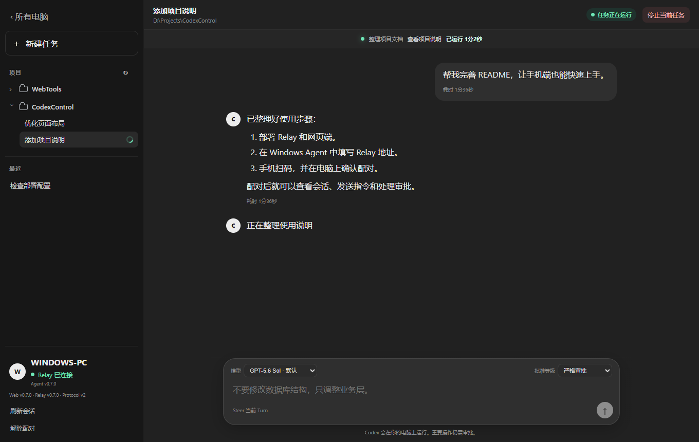
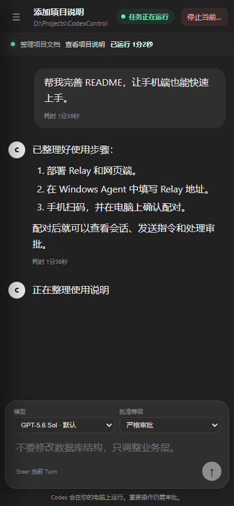

# Codex Control

[简体中文](README.md) | [English](README.en.md)

View, create, and control Codex sessions on Windows from your phone or browser. Self-host the Windows Agent, Relay, and web app.

- Live responses, session history, and concurrent sessions.
- Send instructions, interrupt tasks, and handle approvals.
- Windows system tray, QR pairing, and mobile / desktop browsers.

## Screenshots

<table>
  <tr><th>Desktop browser</th><th>Mobile browser</th></tr>
  <tr>
    <td></td>
    <td></td>
  </tr>
</table>

Actual web app, shown with sample session data.

## Build the Windows Agent

Requires Windows 10/11 x64, PowerShell 7, .NET 8 SDK, Node.js 24, and Inno Setup 6. Install and configure Codex CLI or Codex Desktop on the computer.

```powershell
git clone https://github.com/yuanx0227/CodexControl.git
Set-Location '.\CodexControl'
& '.\tools\Build-Release.ps1'
```

Installer: `out/release/installer/CodexControl-Setup-UNSIGNED.exe`. Running the Agent requires .NET 8 Desktop Runtime and ASP.NET Core Runtime.

## Deploy the Relay and web app

The server needs Docker Compose, a domain, and a trusted TLS certificate.

1. Copy `deploy/.env.example` to `deploy/.env`. Set `CODEX_CONTROL_PAIRING_SECRET` to at least 32 random characters and `CODEX_CONTROL_ALLOWED_ORIGINS` to your web app origin.
2. Place certificates at `deploy/certs/fullchain.pem` and `deploy/certs/privkey.pem`.
3. Run from the repository root:

```powershell
docker compose -f '.\deploy\docker-compose.yml' up -d --build
```

Preserve `.env`, certificates, and the `relay-data` volume across upgrades.

## Pair and use

1. Open the Agent and enter the Relay's HTTPS root URL and a computer name.
2. Generate a pairing code. Scan the QR code on your phone or enter the six-digit code in the web app.
3. Confirm full control or view only on the computer.
4. Select a session in the web app or create a task in an existing project directory.

Agent-managed sessions support live control. External Codex Desktop sessions support history reads on demand.

[Development and local setup](docs/development.md) · [Architecture](docs/architecture.md) · [Security](docs/security.md) · [Changelog](CHANGELOG.md)
