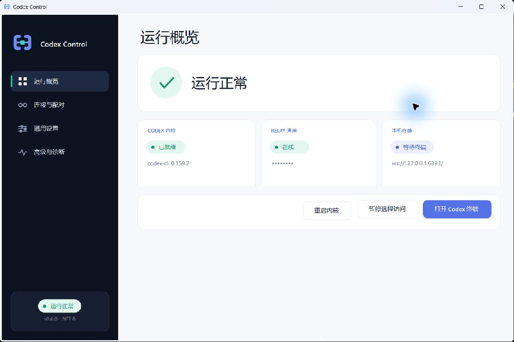

# Codex Control

[简体中文](README.md) | [English](README.en.md)

在手机或浏览器中查看、创建和控制 Windows 上的 Codex 会话。由 Windows Agent、Relay 和网页端组成，支持自托管。

- 实时回复、历史会话和多会话并行。
- 发送指令、中断任务、确认审批。
- 托盘常驻、扫码配对、手机和电脑浏览器访问。
- 可选共享模式：官方 Codex Desktop 与网页操作同一会话。

## 界面

**Windows 桌面 Agent**



<table>
  <tr><th>桌面浏览器</th><th>手机浏览器</th></tr>
  <tr>
    <td></td>
    <td></td>
  </tr>
</table>

桌面截图来自实际运行的 Agent，服务器地址已隐藏；网页截图使用示例会话数据。

## 构建 Windows Agent

需要 Windows 10/11 x64、PowerShell 7、.NET 8 SDK、Node.js 24 和 Inno Setup 6。电脑上需安装并配置 Codex CLI 或 Codex Desktop。

```powershell
git clone https://github.com/yuanx0227/CodexControl.git
Set-Location '.\CodexControl'
& '.\tools\Build-Release.ps1'
```

安装包：`out/release/installer/CodexControl-Setup-UNSIGNED.exe`。运行 Agent 需要 .NET 8 Desktop Runtime 和 ASP.NET Core Runtime。

## 部署 Relay 和网页

服务器需要 Docker Compose、域名和可信 TLS 证书。

1. 复制 `deploy/.env.example` 为 `deploy/.env`，填写至少 32 位随机 `CODEX_CONTROL_PAIRING_SECRET` 和网页地址 `CODEX_CONTROL_ALLOWED_ORIGINS`。
2. 将证书放入 `deploy/certs/fullchain.pem`、`deploy/certs/privkey.pem`。
3. 在仓库根目录运行：

```powershell
docker compose -f '.\deploy\docker-compose.yml' up -d --build
```

升级时保留 `.env`、证书和 `relay-data` 数据卷。

## 配对使用

1. 打开 Agent，填写 Relay 的 HTTPS 根地址和电脑名称。
2. 点击“生成配对码”，手机扫码或在网页输入六位码。
3. 在电脑上确认“完整控制”或“仅查看”。
4. 在网页选择会话，或在已有项目目录中创建任务。

默认独立模式下，Agent 托管的会话支持实时控制；原生 Codex Desktop 外部会话只支持按需读取历史。

## 共享会话模式（实验性）

让官方 Codex Desktop 与 Agent 连接同一个本机 `codex app-server` WebSocket 服务，即可在网页与 Desktop 中操作同一会话：双向实时消息、运行中追加指令（Steer）、人工审批和停止任务。

1. 按[共享模式运行说明](docs/shared-session-implementation.md#当前账户的使用入口)准备共享服务及身份文件，用共享入口打开官方 Desktop。
2. 在 Agent“高级与诊断”中填写“共享服务地址”和“共享服务身份文件”，添加允许网页操作的绝对项目目录（多个目录用分号分隔）。
3. 点击“保存并重新连接”，在网页选择该会话。

共享地址仅允许 `ws://127.0.0.1:<端口>`；项目目录必须在电脑上明确授权，默认禁止网页新增工作。现有会话沿用其模型和权限，审批仍需人工确认。关闭网页、Agent 或 Desktop 只断开各自连接，任务继续由共享服务执行；停止任务使用会话中的停止按钮。

安装升级不会自动切换到共享模式。切换 Desktop 启动方式前需正常退出其窗口和托盘；运行步骤、回退方式、已测版本与剩余验收项见[实施记录](docs/shared-session-implementation.md)。

[开发与本地运行](docs/development.md) · [架构](docs/architecture.md) · [安全配置](docs/security.md) · [变更日志](CHANGELOG.md)
