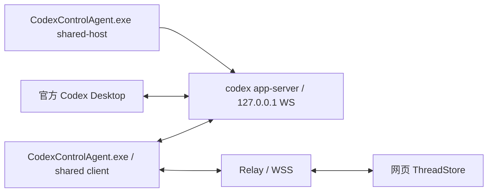

# 共享会话实施与运行

日期：2026-10-03。共享模式实现已安装并实际接入官方 Desktop；现场网页恢复与干预提示修复经真实线上 Relay 和已安装 Agent 验证后，已发布到 https://49.235.119.216。新建 Thread 的现场兼容性修复经确认后已更新本机 Agent，并通过真实网页创建验证。生产发布目录为 `0.7.0-shared-fix-20261003-eca1657-wip`，正常线上网页与 Service Worker 已核对加载新资产。各阶段证据与未完成验收见本页末尾。原型、历史和已有修改保留。设计依据见 [共享设计](shared-session-redesign.md)，探针现场证据见 [Desktop 试验](shared-desktop-trial.md)。

共享模式切换前的现场诊断：用户升级后仍出现“在另一个应用中打开”。只读核实安装的Agent已有共享启动参数，线上Web已有watch/send，但安装目录的旧设置没有sharedEndpoint/sharedManifestPath；Agent PID24120仍创建独立stdio后端33756，Desktop根PID13976另有后端3588，两端均未连接保留的9023共享服务12156。因此安装新包并未完成运行模式切换。当时准备了 `tools/Set-InstalledSharedSession.ps1` 与 `out/shared-mode-switch-20261003/` 检查/切换/回退入口，默认只读；Apply/Restore要求两端已正常退出，未在该次诊断中执行。实际切换及双端验收见本页后文。

## 实现范围

| 用户问题 | 当前实现 |
| --- | --- |
| 任务执行状态错误 | 按 Thread 维护状态与活动 Turn；连接状态独立；未知 Turn ID 保持 active；待审批/待输入优先；旧 Turn 终态不清除新 Turn |
| 新消息需重进会话 | 领域事件独立 sequence/epoch；内存补发；网页按 Thread/Turn/Item 去重归并；首次快照先于设备列表的竞态已处理；正常完成不重新加载历史 |
| 官方 Desktop / 网页同时聊天 | 独立共享 WS 服务、两个独立客户端；共享 watch 不覆盖策略；同 Turn Steer、人工审批、停止；任一客户端断开不拥有服务停止权 |



主要落点：`AppServerBridge`、`SharedServiceIdentity`、`SharedRuntimeHost` 负责连接与生命周期；`SharedSessionOperations`、`ThreadWorkspacePolicy`、`ControlSubmissionLedger` 负责观察/输入/权限和不确定提交；`CodexStateManager`、`ApprovalCoordinator`、`SessionEventJournal`、`DomainEventNormalizer` 负责状态和事件；Relay 校验当前配对权限并只持久化脱敏运行摘要；PWA `threadStore.ts` 形成唯一共享会话视图。

保持 .NET 8、唯一 Windows 产品 exe、公开 app-server JSON-RPC。没有 SSH、Broker、Fork、历史轮询、替代 Desktop、私有 IPC、Hook、UI 自动化或自动批准。

## 已做验证

| 层级 | 结果 / 证据 |
| --- | --- |
| Agent 仓库检查 | 25 项中21项通过，4个需要显式真实环境的入口默认跳过；涵盖共享双连接、策略、状态、审批、事件、恢复预算、慢请求不堵停止、重连上下文与持久幂等 |
| Relay 仓库检查 | 7/7通过；新增共享 watch/send 权限、伪造 allowJoin 清洗、同ID异payload冲突、stream字段转发和正文不落数据库断言 |
| Web | build通过；Chromium/WebKit Playwright完整60项通过，随后增加的“提交结果丢失不自动重发”2项及“超大内容保留/占位/不循环恢复”2项定点通过；含真实Relay的SystemHost，不是仅mock |
| 原探针 | 策略复用改动编译通过，0警告/0错误，原工具保留 |
| 真实共享服务 / 产品 Bridge+Dispatcher | 单独显式运行 `RealSharedSession_Product` 通过；两个真实产品连接使用同一实例，同 Turn 收流，原连接dispose后另一端继续Steer，语义标记正确且正常完成；不使用工具、不自动审批 |

最新真实产品证据：`out/shared-desktop-trial/20261003-retry-8625cb6b/product-6541f79a492c49798c3e14422a12bd9a/result.json`。本次新建独立测试目录与测试 Thread，没有修改旧 Thread 权限；服务身份核验与旧 manifest 匹配。更早一次 `product-aae0d8195096405db8e384fa4624ce1a/result.json` 在加入显式项目授权前通过，仅留作过程记录。两份都标明 `desktopUiVerified:false`。

此前真实 Desktop 与探针双向消息、Desktop 人工批准、退出与重连、不同 Thread 并发已有独立证据；不能把它们与新的 Web 模拟检查拼成“新产品真实 Desktop/网页已全验收”。新宿主从 Explorer 启动的实际 Job/窗口生命周期、Desktop↔真实新版网页的交叉控制仍是下一轮现场验收。

## 当前账户的使用入口

仅选择当前用户已核实的本机服务。高级设置可填写共享地址、manifest、允许远程工作的项目目录（分号分隔）；命令行可重复 `--shared-project-root`。默认无项目授权，只能观察。选择已有共享服务不需要重启 Desktop，不改变其历史或权限。

以下为下一轮运行示例，替换变量为确认过的路径，不包含凭据。所有参数是进程级，不写全局环境或 Codex 配置。使用独立测试数据目录，避免与已运行 Agent 竞争设备身份。

```powershell
$agentExe = 'D:\Yuanx\Code\Ai\CodexControl\src\agent\bin\Debug\net8.0-windows\CodexControlAgent.exe'
$manifest = 'D:\Yuanx\Code\Ai\CodexControl\out\shared-desktop-trial\20261003-retry-8625cb6b\manifest.json'
$workspace = 'D:\指定的独立测试目录'
$trialData = 'D:\指定的独立测试数据目录'
& $agentExe --headless --shared-endpoint 'ws://127.0.0.1:9023' `
  --shared-manifest $manifest --shared-project-root $workspace `
  --data-dir $trialData --log-dir "$trialData\logs" `
  --relay-url 'wss://已授权Relay地址' --pair
```

`--headless` 输出设备身份/配对信息时按本机正常配对处理，不将配对码写入文档。生产 Relay 继续要求 WSS；只有本机开发 Relay 可显式使用 `--allow-insecure-relay`。manifest 不匹配、进程已退出、版本或监听变化时拒绝连接，不偷偷启动第二个 stdio 服务。

若需要新建共享服务宿主，在确认后从 **Explorer/独立 Windows 终端** 使用同一个 exe 的 `--shared-host --codex-path <已核实codex.exe> --shared-endpoint ws://127.0.0.1:<空闲已知端口> --shared-manifest <新文件>`。不能从当前 Desktop 所属进程树或 Job 启动；已存在 manifest/占用端口会拒绝，不覆盖旧实例。宿主窗口保留并排空服务输出，原始输出不落盘。

打开新的官方共享 Desktop 使用 `--shared-desktop --desktop-path <官方WindowsApps包内app\ChatGPT.exe> --shared-endpoint <相同地址> --shared-manifest <相同文件>`。只有这个入口给子进程设置 `CODEX_APP_SERVER_WS_URL`；它拒绝在已有 Desktop 运行时重复拉起。原生快捷方式完全保留。此步骤需要用户先正常退出所有 Desktop 窗口/托盘，必须先确认影响与回退；本轮未执行。

已运行旧试验服务仍由原控制台01/04管理，不关闭这些窗口。新宿主入口的寿命独立性是待实机验收项，不用旧控制器的成功替代。

## 项目范围与 Desktop 辅助目录

- 当前 Thread 的精确 visualization 根属于已查明的 Desktop 辅助范围，允许该根不会放开整个 `.codex`。创建日期按已验证Thread ID规则计算，项目/辅助根及祖先检查重解析点。
- 本机显式授权项目后，共享输入仍读取实际workspace-write、reviewer和目录范围；普通加入/发送不覆盖已有权限。共享新建仅对自己的新 Thread 设置严格目录、网络关闭和两项临时目录排除，再核验有效结果后发送 Prompt。
- Desktop 若选择标准临时目录策略，默认返回 `TEMPORARY_DIRECTORY_REQUIRES_REVIEW`。高级设置的“额外授权 Desktop 标准临时目录”或 `--shared-allow-standard-temp` 需先核实共享服务环境，不能从 Agent 自己的环境反推上游；默认关闭。本轮未启用或更改当前运行配置。
- 未知额外目录/权限不会被悄悄修成允许；观察、目标停止、拒绝/取消仍可用。审批批准前复核范围，最终决定以服务端通知为准。公开接口没有跨客户端原子策略锁，保留该并发边界。

## 恢复边界与回退

事件环为32MiB/10000事件/5分钟，仅内存。正常恢复按游标重放，缺口才读取一次视图。Watch单次成功payload限256KiB；超限明确未同步并保留旧内容，本版没有完整历史跨帧恢复。单条文本超过128000字符有明确truncated/originalLength；事件envelope超过900KiB替换为明确的ContentIncomplete，避免多图片或转义中文撑断Relay连接。活动快照与增量无可靠offset时显示同步中，等完整item收敛。未知item显示不支持，不用全局焦点猜归属。

修改请求结果丢失后不自动重发。无正文submission ledger上限10000；达到上限或磁盘不可用时拒绝新增工作，停止和拒绝仍可用。不要删ledger再自动重放旧请求。

同一个Agent运行期内，`SharedSessionRuntimeContext` 跨上游连接重建保留已核实的服务/Thread观察关系、cwd约束和已知提交结果；仅有view权限的网页可以恢复先前已获准的观察，但不能借此加入不同实例或新Thread。真正进程重启不会恢复内存中的正文/结果，磁盘仅保留提交标识。

退出新 Agent/网页只断开客户端，可立即回到旧 Agent 原启动方式。原生 Desktop 回退需正常退出共享 Desktop 后用原快捷方式重开；共享服务保留到确认无活动任务、无依赖客户端后再明确停止。宿主停止按钮检查身份、连接及loaded Thread状态，但检查与最后停止之间不具有服务级原子性，不能在其他客户端仍会主动重连时使用。

下一轮必须确认的操作是：临时运行新版Agent并配对测试网页、如需要则切换/重启Desktop、实际退出新版宿主或更改服务环境。已有授权范围内的隔离Bridge测试已完成；没有自动部署、重启、升权或安装后台任务。

## 下一轮真实交叉验收

1. 保留当前服务，选新独立项目目录，由本机Agent授权该目录并运行新版测试链路；对照服务PID、创建时间、版本与监听归属。
2. 新建测试Thread，在真实Desktop打开同一ID；网页页面保持打开。两个方向发消息，同活动Turn中分别Steer，核对正文、过程事件与终态。
3. 创建一次需要人工决定的操作，两端确认同一审批；分别由网页/Desktop作决定，确认卡片只在服务resolved后消失。竞争决定只承认服务实际胜出结果。
4. 逐个退出网页、Agent、Desktop客户端再重连，核对服务身份不变、另一端任务继续及未决审批恢复；不能只做Socket reconnect替代进程退出。
5. A等审批时启动B，停止A而B继续；完成状态、输入按钮、列表徽标都按各自Thread收敛。
6. 如需测试新宿主，单独经确认从Explorer启动，验证上述完整生命周期；不把旧试验宿主的通过算成新宿主通过。

## 安装后切换与真实 Desktop / 网页测试（2026-10-03）

安装新 Agent 和新网页资产后，原 Agent 设置仍没有共享连接字段；真实进程核对发现 Desktop 和 Agent 各自运行一个独立 stdio app-server，均未连接已存在的 9023 服务。因此安装完成本身不会切换运行模式。

用户确认切换后，从 Explorer 运行 `out/shared-mode-switch-20261003/02-退出两端后切换共享.lnk`。当前已安装 Agent PID32468 和官方 Desktop PID27924 均与服务 PID12156 的 `127.0.0.1:9023` 建立连接，两个旧 stdio 后端已退出。服务创建时间仍为 `2026-10-03T05:34:52.6917820Z`，实际版本 `codex-cli 0.160.0`；Desktop 完整包版本 `26.930.3930.0`。联合进程身份与监听/连接归属证明这次确实接入同一服务实例。

新建测试 Thread `01a100f6-d46b-73d2-adeb-f3c1a008eaf2`，工作目录为上述切换目录内的 `workspace`。真实 Desktop 已由用户打开同一 ID；网页收到共享能力并成功 watch。网页输入标记由用户确认在 Desktop 实时出现；Desktop 反向输入与回复在未重进的网页自动出现。两个方向都捕获了对应 Turn 的用户消息、流式输出、完成消息和完成事件。此结果只完成双向实时消息验证。

Desktop 输入后的权限读回仍为 workspaceWrite/untrusted/user，网络关闭，两项临时目录排除均为 true。新增目录恰为当前 Thread 的精确 visualization 根，目录及祖先无重解析点，产品 watch 返回 `controlAllowed:true`；没有通过覆盖权限迁就测试。严格探针的拒绝结果不能替代产品权限结论。

这次真实测试另发现网页恢复错误：先前大历史 watch 失败留下的恢复状态，会阻止其他 Thread 对设置更新或上游 epoch 变化进行自动恢复；最终事件已到达，界面仍停在“正在同步任务状态”并禁用输入。手动 watch 能恢复，但不计为自动恢复通过。已改为按 Thread 识别新增恢复需求，流缺口恢复仅覆盖当前可恢复的已观察 Thread；不借其他 Thread 的变化循环重试已经明确失败的大历史。

新增定点用例在旧逻辑下复现“期望第2次 watch，实际只有1次”。修复后 Chromium/WebKit 的10项相关定点检查与网页构建通过；恢复修复初版资产为 `index-BAzXd7CF.js`，加入持续干预反馈后资产为 `index-BBmRh4ow.js`。现场修复验证时在线网页仍为旧 `index-BABiGGA_.js`，不能把源码检查当成部署完成；本页末尾记录了随后的生产发布。`04-新版网页实测.lnk` 从 Explorer 启动仅绑定 `127.0.0.1:5511` 的独立静态网页服务。

本地 origin 的真实 Relay WS 握手被生产 allowlist 以403拒绝。实际验证在已配对的 HTTPS 页面中由 Playwright 仅替换静态资源，逐页禁用 Service Worker 读取旧资产；控制器仍使用原 HTTPS origin、原非导出身份以及真实 `/ws/controller`。没有拦截或模拟 WebSocket，没有复制身份或放宽 allowlist。该浏览器设置只用于试验，生产更新和缓存切换尚未验收。

### 当前真实交叉结果

| 项目 | 现场证据与边界 |
| --- | --- |
| 同一服务 | 服务12156 / `2026-10-03T05:34:52.6917820Z` / Codex0.160.0 / loopback9023；Desktop27924与Agent32468均有对应连接；无Broker |
| 双向消息与完成 | 真实两端输入及回复自动出现，网页连续打开；大历史 watch 失败保留时，目标任务仍自动完成并恢复输入 |
| 网页 Steer | Desktop 发起的 Turn `01a10124-9e7e-7f10-b65a-9fd3245cbc43` 内接受 Steer，最终 `WEB_STEER_1003`；用户确认 Desktop 最终回复 |
| Desktop Steer | 用户两次都在 Desktop 输入；Turn `01a1014b-41ec-72e0-bbc6-fcf1456951e2` 保持不变；网页实时观察到对应输入事件，最终 `DESKTOP_STEER_ONLY_1003` 恰好一次并自动完成 |
| 两端人工审批 | Desktop允许一次后网页卡片消失并完成；网页允许一次后用户确认 Desktop 卡片消失及 `APPROVAL_WEB_DONE_1003`；两个测试文件仅含指定标记，无自动审批 |
| 实际网页退出 | 真正关闭页面再打开，同一待审批 Turn/审批恢复，Desktop任务和服务身份保留；不是仅 Socket 重连 |
| 定向停止 | 网页停止 Turn `01a10151-a327-7230-87d7-f05059eaa722`；服务终态 `interrupted`，卡片及干预提示清除、输入恢复；未批准文件未创建；用户确认Desktop停止及卡片消失 |
| 不同 Thread 并发 | 修复后由正常网页新建B。A的Turn `01a10164-c6c1-75c3-a1e7-66ad2dab074a` 等审批，B的Turn `01a10165-37de-7bd2-b564-efa19e1b669d` 输出；A于10:54:12.223Z停止，B仍活动并于10:54:49.687Z正常完成，最终标记正确；未批准A文件未创建 |
| Agent进程退出 | 用户正常退出原Agent32468并确认Desktop继续输出；公共观察连接在Agent缺席时确认任务已完成。修复版Agent25268于10:50:43.9932111Z重开，服务身份不变；原网页自动恢复同一Turn终态及 `CC_AGENT_EXIT_SURVIVE_1003`。未单独测试Agent退出时的未决审批恢复 |
| Desktop进程退出 | 11:03:02.3266751Z确认官方进程为0，网页与Agent仍运行。网页Steer在11:03:25.328Z被原B Turn接受，11:03:58.014Z正常完成并输出 `CC_DESKTOP_EXIT_WEB_SURVIVE_1003`。Desktop2508于11:04:01.4249250Z重开并连接同一服务；原A Turn/审批未取消。用户确认Desktop恢复原审批卡片并允许一次；网页收到原审批resolved seq5535、原Turn completed seq5551，最终 `DESKTOP_REJOIN_APPROVAL_DONE_1003`，卡片清除及输入恢复；指定测试文件内容正确 |

网页 Steer 请求在 `09:45:49.985Z` 发出、`09:45:50.621Z` 被服务接受，但输入消息通知直到 `09:47:07.081Z` 才出现。实测证明同 Turn 生效，不能承诺 RPC 确认就立即中断输出或让 Desktop 立刻显示消息。

PWA 现在将最近一次已确认的 Steer 显示在独立的“干预已接受”状态提示中；正文不伪造服务消息，结果未知仍不自动重发。仅目标 Turn 的当前权威终态会清除提示。构建及 Chromium/WebKit 的4项定点检查通过；实际审批等待期间提示持续可见，停止该 Turn 后自动清除。该状态只在页面内存中，关闭页面不持久化输入正文。

### 首个 Turn 前新建失败的修复

实际 `control.thread.start` 请求 `req_14581d05f6e4444f96f713acca7370e7` 创建了 Thread `01a10154-24b9-7370-987b-30a34643c8d8`，随后 `JoinAsync` 的 `thread/resume` 返回 `no rollout found`，首条 Prompt 未发出。Codex0.160.0 的新 Thread 在首个 Turn 前可能没有持久历史，不能把提前 resume 当作首次权限核验的必经步骤。

新建路径用 `thread/start` 返回的有效策略核验目录、网络、临时目录、审批及 reviewer，登记同一已核实服务上的创建者观察关系，再启动首个 Turn。仅作用于本产品刚创建的 Thread；已有 Thread 的正常加入和输入继续走不带覆盖字段的权限读回，没有降低门槛或修改现用会话权限。没有通过命名、历史轮询或 Fork 迁就测试。

模拟服务在首个 Turn 前返回相同 resume 错误，旧逻辑定点复现失败；修复后的 `SharedTransport_IndependentConnections` 通过，包含额外权限阻断输入等原有断言。只构建了需要的 Agent 二进制，未重跑全量检查。

现场操作入口 `05-退出Agent后更新并重开.lnk` / `06-退出Agent后回退exe并重开.lnk` 只在 Agent 已正常退出后替换一个 exe并重开；原 exe保存在试验目录，设置与设备身份沿用、不复制凭据。用户经确认执行05后，本机Agent已是修复版；首次创建的真实新Thread为 `01a10165-36d7-7203-bbf0-912ed0f74d75`，正常创建请求 `req_0e3aa5ab149943c8ae03ba8c26b4467a` 成功，没有提前resume或命名来触发历史文件。

`07-仅重开官方共享Desktop.lnk` 在确认后单独重开共享Desktop，避免误用要求两端退出的02切换入口；原生Desktop快捷方式保留。此次实际退出期间，Agent和真实网页继续工作，旧服务12156一直保留；没有将旧宿主结果记作新 `--shared-host` 宿主的寿命验收。试验浏览器PID30808的父进程30088属于共享服务进程树，实际Desktop退出后浏览器保持打开，此次存活事实已有证据。

脱敏证据保存在 `out/shared-mode-switch-20261003/product-desktop-web-result.json`。本机当前共享服务上的功能交叉检查已完成：两个方向消息与Steer、两端人工审批、定向停止、不同Thread并发、实际网页/Agent/Desktop退出与重连。尚未验证Agent在未决审批中的进程重启、新 `--shared-host` 宿主的实际寿命或真实移动设备；上游输入事件延迟也不因功能检查通过而视为满足即时渲染。现场修复已安装Agent exe；新网页随后发布，见下节。本轮没有提交或推送 Git。

### 生产发布：2026-10-03

用户授权部署后，按发行脚本在独立源码目录构建 Agent、Relay、PWA 和未签名安装包；复用已完成的测试，没有重新执行全量测试或生成、验证哈希清单。独立目录避开现场进程占用的 Vite 依赖，原仓库中打包尝试缺失的依赖文件已恢复。产物在 `out/release-shared-update-20261003/`，脱敏部署证据在 `out/deploy-shared-update-20261003/deployment-result.json`。

- 访问地址：`https://49.235.119.216`。
- 当前目录：`/opt/codex-control/releases/0.7.0-shared-fix-20261003-eca1657-wip`，`current` 已指向该目录。
- Relay/Web 镜像：`codex-control-relay:shared-fix-20261003-eca1657-wip`、`codex-control-web:shared-fix-20261003-eca1657-wip`，均 healthy；网关沿用现有 nginx 镜像。
- 现场镜像基于实际在用的同框架镜像分层构建：Relay 为 .NET 8.0.30、UID/GID 10001；Web 为 nginx 1.29.8。只在发布目录生成现场 Dockerfile，没有修改仓库的通用 Dockerfile。
- 复用 Compose project `codex-control` 和原数据卷 `codex-control_relay-data`（创建时间仍为 2026-08-22）；发布前后均为 4 个设备、8 个 Controller、8 个配对、3 条 Migration。原 `.env`、证书和上一发布目录保留，没有输出凭据或移除数据卷。
- 新 JS/CSS 为 `index-BBmRh4ow.js`、`index-BuouwbLf.css`。全新 Playwright 浏览器直接从线上取得两者，启用正常 Service Worker 后刷新也取得两者；没有本地资源覆盖或 WebSocket mock。HTTPS `/healthz` 返回 200、protocolVersion 2，公开 WSS 收到协议响应。
- 全新浏览器未配对，因此收到预期的 `AUTH_FAILED`（公开接口拒绝未注册 Controller），没有生成额外配对或绕过认证。原已配对试验浏览器的自动化连接已断开，生产发布后的该身份重连没有复验；不能把公开 WSS 可达记为已配对双端功能再验收。
- 本机共享服务 PID12156、Agent PID25268、Desktop PID2508 的创建时间保持不变；Desktop 和 Agent 仍直接连到原服务的 9023。此次服务器发布没有重启这三个本机进程。

上一版本为 `/opt/codex-control/releases/0.7.0-shared-20261003-eca1657-wip`。失败回退使用上一目录的 `deploy/docker-compose.artifacts.yml` 与原 `.env`，以同一 Compose project 执行 `up -d --no-build --pull never --wait`，再原子恢复 `current`；不执行 `down -v`。本机部署辅助目录保存 `rollback.sh`，不会自动触发 Desktop/Agent 模式切换。发布来自已测试的工作区修改，发行标识含 `wip`，不是新的已提交 Git 版本。
