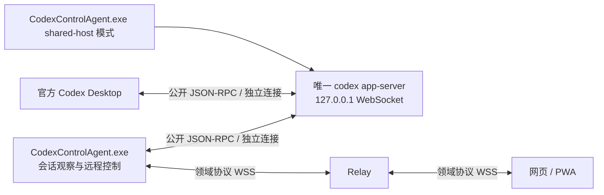

# 官方 Desktop 与网页共享会话改造设计

日期：2026-10-03。状态：用户确认后已进入实现；当前实现、测试和现场剩余验收见 [实施记录](shared-session-implementation.md)。下文的只读取证与实施前差距保留为设计依据，不代表代码仍停留在旧行为。以本机 Desktop `26.930.3930.0`、共享 app-server `codex-cli 0.160.0` 的既有实测为兼容性起点，不宣称隐藏启动入口获得官方稳定支持。

## 1. 新增可写目录的只读结论

当前测试 Thread：`01a10081-78c0-7851-a412-58e2b1febd88`。

| 项目 | 现场结果 |
| --- | --- |
| cwd | `D:\Yuanx\Code\Ai\CodexControl\out\shared-desktop-trial\20261003-retry-8625cb6b\desktop-ui-bdec23ae0ae148da885b2251d41d4e86\workspace` |
| 唯一额外 writableRoot | `C:\Users\Yx\.codex\visualizations\2026\10\03\01a10081-78c0-7851-a412-58e2b1febd88` |
| runtimeWorkspaceRoots | 上述 cwd 加上述 visualization 目录，共 2 项 |
| 有效策略 | `workspaceWrite`、`untrusted`、reviewer=`user`、networkAccess=`false`；两项临时目录排除仍为 true |
| 路径检查 | 额外目录存在，自该目录直到卷根的父目录均不是 reparse point；未读取目录内文件或任何认证文件 |
| 变化时机 | Desktop 发起无工具消息前推送 `thread/settings/updated`，随后启动 Turn `01a10084-f0c1-7ae2-b616-fdb94d6ce213` |

**结论：这不是新增的其他项目目录，也不是开放整个 `.codex`。它是官方 Desktop 为当前 Thread 准备的可视化产物目录。此次没有发现实际越权目录，严格探针的拒绝不构成共享会话方案的阻断。**

授权需要分两层理解：该路径不位于用户授权的 CodexControl 源码项目树内，不能称为“项目子目录”；它属于 Desktop 的会话辅助工作范围，且日期和 ID 与当前 Thread 一致。当前 CodexControl 会话的环境上下文本来就同时提供项目根与另一条本会话专属 visualization 根。这是同类 Desktop 工作方式的旁证，不意味着可放行整个用户目录、整个 `.codex`、其他 Thread 的产物目录，或任何与项目无关的写入。本次授权结论仅针对已查明的当前 Thread 辅助目录，不是对全部 Codex 配置的安全审计。

### 1.1 为什么加入：本机包内静态调用链

只读解析当前官方安装包 `app/resources/app.asar` 的文件索引和相关 JavaScript，没有执行包内代码、调用私有 IPC、Hook、注入或修改包。

`webview/assets/app-shared-2d992d47c83d.js` 中的关键链路：

1. `Ikn(base, threadId)`（字符偏移约 3524922）通过 Thread ID 推导日期，将 `base/visualizations/date/threadId` 作为专属目录。
2. `uRn(...).getVisualizationRoot(...)`（约 3646007）从 Codex Home 或 Desktop workspaces root 选择基址；本机读回路径确认此次用了 Codex Home。
3. `Nrn(...)` 为 Turn 准备逻辑提供 `getAdditionalWritableRoots`，有 Desktop runtime 时调用上述目录函数（约 2947954）。
4. `Srn(...)` 调用 `getAdditionalWritableRoots`，对结果 `ensureDirectory`，经 `ge.reduce(Ern, fe)` 合入 sandbox，并准备 runtime roots（约 2938417）。
5. `.vite/build/bootstrap-CZlEGA2m.js` 的 Turn 准备路径也含相同 `getAdditionalWritableRoots → getVisualizationRoot` 行为。

这解释了为什么“探针创建 / Desktop 仅打开”时仍只有隔离目录，而“Desktop 发出第一条消息”时加入可视化目录。静态链路与公开 JSON-RPC 的前后有效策略及通知一致；没有抓取 Desktop 发出的原始请求，因此不声称获得其完整请求载荷。压缩函数名和偏移只用于此次版本取证，产品不得依赖、解析或调用这些内部实现。

此前把“多一个 root”直接描述成方案级权限阻碍过于严格，现修正为探针测试范围与 Desktop 原生辅助范围不一致。探针原测试结果保留，不把原来的 `controlAllowed:false` 改写为通过。

## 2. 产品目标与当前证据

官方 Desktop 和网页连接同一服务实例，操作同一个活动 Thread/Turn。两端都可输入；运行中的输入走 Steer，停止走 interrupt，审批由人明确选择。任一客户端离线不终止另一端任务。不同 Thread 并行；不使用 SSH、Fork、交替接管、历史轮询或替代桌面。

| 能力 | 已有证据 | 实施后仍需验收 |
| --- | --- | --- |
| 同一服务 | PID `12156`、UTC 创建时间 `2026-10-03T05:34:52.6917820Z`、已识别版本及 `127.0.0.1:9023` 监听，Desktop 与探针连接对应它，无 Broker | Agent 真实 WS 接入；不能以 Thread ID 相同替代服务身份 |
| 双向消息 | 探针发消息、Desktop 展示；Desktop 发消息后原探针收到 userMessage、delta、completed、idle | 网页保持打开时实时展示；完整正文、事件顺序和不重复 |
| Steer / stop | 探针同 Turn 语义 Steer 生效，interrupt 得到 interrupted 终态 | Desktop 与网页互相 Steer/停止的完整交叉矩阵 |
| 人工审批 | Desktop 批准，探针收到 resolved、命令完成、Turn 完成；测试文件正确；用户已确认卡片消失、运行结束 | 网页批准、Desktop 收敛；不同决定竞争只能有一个生效 |
| 生命周期 | 整个探针进程退出不打断任务；Desktop 真正退出后探针可继续同 Turn，Desktop 重开连接同服务 | 新 Agent、Relay、PWA 断开/重连；重连同 Thread UI 与未决审批 |
| 并发 | A 等审批时 B 完成，停止 A 不停止 B | 网页项目列表和多个聊天窗口状态各自正确 |

官方 App Server 文档页面及其 `.md` 地址本轮抓取均返回 403；不把未读取的官方网页作为证明。本设计的当前版本事实来自现有公开协议实测、产品源码和上述本机包的静态取证；新接口能力以实施时匹配该可执行文件的 schema 和实测为准。

## 3. 实施前代码的具体缺口

| 位置 | 源码事实 | 设计处理 |
| --- | --- | --- |
| `src/agent/Codex/AppServerBridge.cs` | StartAsync 创建独占 stdio 子进程，握手后直接 MarkIdle；StopAsync 可终止子进程树 | 传输与服务生命周期分离，增加共享 WS Adapter，初始化不代表会话闲置 |
| `src/agent/State/CodexStateManager.cs` | 已处理 thread/status/changed；没有已知 activeTurn 时该通知被忽略；item 回退会影响全局状态；同一状态结构混用连接和任务信息 | 引入逐 Thread 权威状态、订阅恢复和独立连接状态，不能只加一个事件分支 |
| `src/agent/Relay/DomainEventNormalizer.cs` | 已有 UserMessageCompleted/ThreadStatusChanged；revision 来自状态快照，不是每个 delta 的序号；缺失 ID 会回退全局焦点；正文有固定截断 | 分离事件序号与状态修订；不猜测并发 Thread 归属；明确分页/片段与截断语义 |
| `src/agent/Relay/RelayClient.cs` | 事件发送依赖当前 outbound；入队失败结果未形成可恢复缺口；重连主要发送最新 Snapshot | Agent 保留有界内存事件/会话视图，按游标恢复；溢出明确 resync |
| `src/web/src/relayClient.ts:594` | 每 Device 最多保留 100 条聚合事件，delta 直接追加；聚合后并不保留每个 delta 的独立去重记录 | 按 Thread/Turn/Item 的状态仓库与独立序号水位，避免跨 Thread 淘汰和重复追加 |
| `src/web/src/App.tsx` | 历史、本地输入、实时事件三套来源合并；完成后触发 history reload；用 Snapshot revision 过滤事件 | 单一会话视图 reducer；实时事件驱动、首次/缺口恢复读快照 |
| `src/agent/Control/RemoteControlDispatcher.cs` | ResumeThreadAsync 同时覆盖模型/审批/sandbox 并启动 Turn | 订阅、继续输入、显式新建/配置三条语义分开；共享加入不覆盖现用权限 |
| `src/agent/Codex/ApprovalCoordinator.cs` | 当前本地锁适合同一 Bridge；发送响应后即可 Complete | Desktop 直连会绕过该本地锁，最终状态以服务端 resolved/lifecycle 为准 |

这是源码确认的缺口，不宣称每一处都已复现为用户原始三个症状的唯一原因。独立服务使 Desktop 事件无法进入现有 Agent，是共享实时链路的根本拓扑问题；修完 UI 本身不能解决它。

## 4. 推荐拓扑与生命周期

选择直连同一个原生多客户端 WS 服务，本版不增加 Broker。保留唯一 Windows 产品可执行文件 `CodexControlAgent.exe`，通过模式区分共享服务宿主和连接/托盘角色；不增加桌面 DLL、插件或替代 Desktop。

共享宿主在当前 Windows 账户独立运行，不能属于 Desktop 关闭会清理的进程树或 Job。它只负责服务实例身份、启动、输出排空和明确停止；Web、Desktop、Agent WS 的连接取消不传播为服务停止。不要求管理员、全局环境变量或新 Windows 服务。具体独立进程启动/Job 行为是实施验收项，不能因为配置了子进程就宣称满足。

服务身份描述仅保留本机路径、PID、精确创建时间、版本、loopback 监听归属及本次实例 ID。所有 PID 操作重新检查创建时间与镜像，防止 PID 复用。Agent 的重连代次与服务实例代次不同；重连次数不证明服务相同。以后若加入 Broker，必须再独立记录上游实例，此设计没有该层。

提供额外“共享模式打开官方 Codex”入口，原生快捷方式保留。隐藏 `CODEX_APP_SERVER_WS_URL` 只设置在启动 Desktop 的子进程环境；不改包、不写全局设置。已有 Desktop 活着时不能静默替换、重复拉起或夺取会话；首次进入/退出共享模式需要告知用户关闭窗口和托盘的影响，并等其确认。升级后重新识别包与内置服务实际版本，未验证组合显示兼容性未知，不能偷偷退到第二个 stdio 服务后仍标注“共享”。

回退：用户结束/停止自己的测试任务，确认没有活动 Turn 和其他客户端依赖后，明确退出共享 Desktop，再以原生入口启动；有活动任务或无法确认时保留服务。不迁移历史、不删除配置、不回滚用户未提交修改。不在此设计阶段执行这些操作。停止共享宿主与“关闭控制界面”是两个明确不同的操作。

## 5. Module 与 Interface

这些名字表达设计职责，实际类型名及落点见实施记录；保持 .NET 8。

| Module | Interface 与不变量 | Implementation 的主要责任 |
| --- | --- | --- |
| SharedRuntimeHost | `StartOrLocate / Describe / StopWhenIdle`；关闭客户端不停止执行者 | 本机独立进程、版本检查、loopback 归属、原生/共享启动入口 |
| AppServerConnection | `Connect / Request / Respond / Messages / Disconnect`；Disconnect 不拥有共享服务 | 现有 stdio 与新共享 WS 两个 Adapter；独立握手、分帧、超时、连接代次；共享模式不透传 TUI 握手缓存 |
| SharedSessionCoordinator | `Watch / Unwatch / ReadView / Submit`；只输出领域视图，按 Thread 管理 | 公开订阅、快照与事件合并、权限上下文、活动 Turn、去重与重连恢复 |
| SessionPolicyEvaluator | `Evaluate(effectiveContext, authorizedScope)`；不修改服务器策略 | 项目根与专属辅助根校验、能力决定、策略变更解释 |
| ApprovalCoordinator | `Pending / SubmitDecision / ObserveResolution`；发送成功不是已批准 | 客户端决定与服务最终决议分离；未决请求重放和冲突收敛 |
| Web ThreadStore | `applySnapshot / applyEvent / selectThread`；唯一 UI 会话状态源 | 按 Item 更新正文、状态徽标、输入提交、滚动/未读状态 |

`RemoteControlDispatcher` 仍为所有远程操作入口，Relay 和 PWA 不解析原始 app-server Thread。先把现有状态/归并复杂性移入这些 Module，再删去 App.tsx 的重复推导，不在旧推导旁再叠一套状态。

## 6. 权限模型：识别实际范围，不沿用探针的单目录假设

范围分为 `ProjectRoots` 与 `ThreadArtifactRoots`。初次授权项目仍来自用户本机选择与现有配对权限；不能从 Desktop 的任意返回路径推导“用户已授权该项目”。

专属 artifact 根仅接受：可信本机 Codex Home（或另行核实的官方 workspaces root）下精确的 `visualizations/<Thread创建日期>/<当前ThreadID>`。日期来源必须匹配官方生成规则和 Thread 元数据，不能只用当前日期或宽松正则。使用 Windows 正规化路径、按路径段比较、检查目录和祖先 reparse point；禁止 `..`、其他 Thread、整个 `.codex`、凭据文件、用户根或项目外任意目录。未来其他官方辅助目录单独取证，不自动归入白名单。

已验证的当前 Thread artifact 目录显示为“Desktop 会话产物目录”，无需为每次正常 Desktop 发消息再弹权限确认；它不增加项目文件访问范围。保持 workspace-write、当前审批策略及 reviewer；不通过 thread/resume 覆盖会话权限以迁就网页。

权限判定输出细分能力：`canView / canSend / canSteer / canInterrupt / canDecideApproval` 和原因。未知额外根使新增远程工作进入待核实状态，仍可观察现有任务；经配对授权的停止和拒绝/取消属于限制执行，不应被“不能发送”一并禁用。批准仍校验实际请求、范围和用户明确决定。

`thread/settings/updated` 使策略缓存失效，下一次新增工作前经公开接口重新取得有效上下文。App-server 未提供与所有 Desktop 写入原子比较的策略版本条件时，Agent 的检查不能宣称跨客户端原子强制锁；串行化自己的操作、处理通知及权限变化，但不绕过 Desktop 会话锁、不强行重写其设置。高于已授权范围的 Desktop 本地选择不等于网页获得同等控制权。

普通共享输入默认继承模型、审批、cwd 和有效 sandbox，不携带默认选项覆盖它们。远程新建继续走既有绝对 cwd、模型列表与 workspace-write 规则。配置修改是单独的闲置操作，不与打开聊天或恢复连接捆绑。

## 7. 运行状态设计

连接状态与任务状态分开：

- `connectionState`: connecting / online / reconnecting / offline；带 freshness 与服务实例 ID。
- 每 Thread：`threadState`: idle / active / notLoaded / systemError / unknown；`activeTurnId` 可以暂时未知。
- 每 Turn：inProgress / completed / interrupted / failed；保留最后终态，不能被后续 idle 覆盖。
- `activity`: thinking / streaming / runningCommand / editing；与 waitingOnApproval、waitingOnUserInput 独立存储。

界面优先显示待审批/待输入，其次运行活动；服务离线显示“连接中断，任务状态待同步”，不伪装闲置或失败。所有列表、标题栏、输入框和停止按钮读取同一个 ThreadStore 的同一条视图。

处理规则：

1. 即使没见到 turn/started，也保存 thread/status/changed(active)，显示“运行中，同步任务信息”；一次恢复读取补齐 Turn ID，而不是丢弃通知。
2. `item/completed` 只结束该 Item，不能宣告 Turn 完成；待审批标志不能被另一个 Item 的 started 覆盖。
3. RPC 接受 interrupt 后显示“正在停止”；收到目标 Turn 的权威 interrupted 才显示已停止。
4. `thread/status/changed(idle)` 与 `turn/completed` 分属 Thread/Turn，两种顺序结果一致；notLoaded 不等于完成，systemError 不随意改写已完成 Turn。
5. 旧 Turn 完成不清除新 Turn；缺失归属不回退到“全局当前会话”。不能正确关联的事件记录白名单诊断并触发定点恢复。
6. 各 Thread 状态独立，设备摘要仅为聚合（如“2 个运行、1 个待审批”）。

## 8. 实时订阅、消息归并和恢复

### 8.1 加入与发现

Agent 握手后先建立通知接收，再通过公开接口加入指定 Thread。对当前 0.160 的订阅实测路径是无模型/cwd/权限覆盖的 `thread/resume`；它保留观察关系，不发送 Prompt，不等于现有产品的“恢复并启动 Turn”。不能为活跃 Thread 走现有 ResumeThreadAsync。

新增 `control.thread.watch` 作为领域操作。涉及首次上游 resume 的共享加入初版仍要求 `steer` 权限；仅有 `view` 的客户端可读取已经授权观察的领域快照/事件，不能借 watch 自动激活或恢复一个未观察 Thread。这与现有“Thread resume 需 steer”一致。项目规则实施时明确：只读加入活跃 Thread 的订阅与携带输入/配置的恢复操作不同，后者仍禁止覆盖活动 Turn。

首次连接可用一次 loaded/list 辅助发现，再分别建立授权观察；不能将它单独当作实时订阅或服务同一性的证据。新 Thread 的发现优先由经实测确认的创建/目录变更事件驱动。0.160 是否向未订阅连接广播所有新 Thread 需要专项确认；若没有该能力，首版明确按用户选中的 Thread ID 加入，不能承诺所有未知 Thread 自动出现，更不能加定时历史轮询掩盖。

### 8.2 领域数据与序号

领域流新增 `serviceInstanceId`、`streamEpoch`、`sequence`；状态另有 `stateRevision`。事件序号每条递增，不能用 stateRevision 给 delta 排序。UI 键为 `(deviceId, serviceInstanceId, threadId, turnId, itemId)`，不能仅按文本或 eventId 合并用户输入。

Agent 保留有界内存的 Thread 视图和短期领域事件环，建议起始上限 32 MiB / 10,000 事件 / 5 分钟，任一上限先到即淘汰；参数实施时与现有消息大小限制对齐。Relay 只转发和缓存必要元数据，不持久化正文。断线不把事件直接静默丢弃；超出保留范围明确返回 `resyncRequired`。

流式正文按 Item 分片更新，带绝对 offset/itemRevision；客户端检测重叠、缺口、重复，不重复拼接。完成事件以权威完整 Item 取代 provisional 内容；超出单帧限制分页/分块并标明范围，禁止添加省略号后当作完整正文。常见过程事件（命令/命令输出、文件变更、公开计划与推理摘要、审批、错误、Turn 生命周期）明确映射；不索取隐藏推理内容。未知类型显式标记未支持，不声称全量事件完整。

### 8.3 恢复的一致性

客户端带 `(streamEpoch, afterSequence)` 重新 watch：同代次且环内完整则重放缺失领域事件；否则返回最新视图及新的水位。快照只在首次加入、重连或检测到缺口时经公开接口恢复，绝不周期性拉历史模拟实时。

上游没有跨 snapshot/通知的原子游标，因此 Agent 先缓冲事件再取当前 Thread/Turn/Item 快照，按 Item ID 与版本合并：终态优先、完成正文替换；快照进行中的 Item 与缓冲 delta 无法确定重叠时保留“同步中”，进行一次针对性完整 Item 恢复或等权威 completed，不盲目追加。Agent 本地 sequence 不能证明上游从未丢事件。若版本接口不足以保证活动正文重连无缝，明确标为实施验收未通过，不能假定协议提供该能力。

网页切换聊天只改变选择，不销毁会话状态；组件重挂载不影响 Agent 订阅。PWA 后台恢复沿同一路径恢复。终态靠事件更新；不再以“完成后重载历史”作为正常链路。历史分页仍可用于用户主动查看更多。

## 9. 输入、Steer、审批与并发

- 闲置：向已有 Thread 发送 turn/start；活动中：发送 turn/steer，必须带 expectedTurnId。共享加入不创建另一个 Thread。
- 过期 expectedTurnId 明确返回冲突，不能自动转 turn/start 或静默重发。输入框显示“发送中 / 已接受 / 结果待确认 / 失败”，接受不等于完成。
- 本地按 Thread 串行化自己的提交，不能阻止 Desktop 直接并发；权威返回决定实际 Turn。若闲置检查后 Desktop 抢先启动，turn/start 可能归入已活动 Turn，应展示真实归属，不能“先报失败再重试”造成重复输入。具体版本行为需交叉实测。
- 每个控制沿用 requestId，按 Controller/Device/请求种类去重。同一 requestId 不允许不同载荷；断线后先查已知结果，未知结果不自动重发。Agent 崩溃后不能凭内存去重宣称 exactly-once；只持久化非正文的请求结果元数据，不能恢复确认则显示“结果未知”。
- 审批：服务端是 Desktop 与 Agent 两条直连之间的最终裁决者。本地 CompareExchange 只能防本地重复，不能宣称它决定跨客户端先后。发送后进入 resolving，收到 serverRequest/resolved 或对应权威生命周期才收敛；不自动批准。
- 审批只展示服务返回的 availableDecisions，不强行假设都有 decline/acceptForSession。选择仅批准本次默认最明显；扩展权限/会话长期批准必须是独立明确选择。服务未返回胜出者时显示“已处理”，不猜测谁胜出。
- 审批 ID 绑定服务实例、连接代次及 Thread/Turn/Item；重连重放映射为同一领域请求，旧连接的决定不能直接回答新请求。
- 不同 Thread 并行，不持有设备级执行锁；停止 A 仅针对 A 的 Turn。

## 10. 协议和代码改动清单

新契约通过 capability `sharedSessionV1` 协商；保留 v2 Envelope，但不能把新必需字段假装兼容旧客户端。缺少能力时显示需要升级，不静默降级到历史轮询。新增常量统一在 `RelayMessageTypes.cs`，同步 Agent、Relay、PWA types 和 `docs/protocol.md`。

| 拟定消息/字段 | 用途 | 权限 |
| --- | --- | --- |
| `control.thread.watch` / `unwatch` | 指定 Thread、流游标；仅管理本客户端观察关系 | view；首次上游 resume 另需 steer |
| `codex.thread.snapshot` | Thread/Turn/Item、未决审批、策略能力、服务实例、流代次、水位 | view |
| `codex.stream.gap` | 表明需恢复，禁止把缺口当完成 | view |
| 扩展 `codex.event` | sequence、streamEpoch、稳定 Item 归属、正文片段 | view |
| `control.thread.send` | 闲置新 Turn 或指定活动 Turn Steer，明确模式与 expectedTurnId | steer |
| 扩展 control.result | accepted / rejected / outcomeUnknown 与实际 Thread/Turn | 原控制权限 |

实施修改范围：Agent 的 bridge/lifecycle/settings/runtime resolver、State 与 Normalizer、RemoteControlDispatcher、ApprovalCoordinator、RelayClient；共享协议契约；Relay 权限路由/请求追踪/内存恢复；PWA RelayClient 与独立 ThreadStore、App 消费视图；部署/运行文档和明确的共享入口。保留 DPAPI、非导出 Controller Key、一次性配对、当前 Pairing Permission 校验和 HTTPS/WSS。无需为正文增加数据库持久化；如请求元数据确需 schema 变化，走 checked-in EF Migration，不使用 EnsureCreated。

## 11. 实施顺序、验收和停止条件

原定实施顺序如下。用户已确认开始实施，当前完成度见实施记录；保留现有原型和未提交修改：

1. 校正探针的“项目 + 精确 Thread artifact”策略识别，并补 Desktop 发起后探针控制的测试；不同 Thread 根与重解析目录必须被拒绝。不通过重写会话权限完成测试。
2. 增加共享 WS Adapter 与独立生命周期，验证 Desktop/Agent 的实例证据、退出重连；旧 stdio 作为明确的独立模式保留，不冒充共享。
3. 完成逐 Thread 状态、订阅/恢复与领域事件序号；再让 Relay/PWA 消费，最后移除旧 UI 重复推导。
4. 完成公共操作入口、输入幂等、审批 resolving/最终收敛、政策变化处理。
5. 同步文档与针对改动的测试，再执行仓库要求的 Agent/Relay 检查、Web build/test；网页交互及 WebSocket UI 使用 Playwright。真实 Desktop 操作由用户手动完成，不模拟输入。

| 必须通过的场景 | 验收结果 |
| --- | --- |
| Desktop 发起，网页已打开 | 用户消息、流式回复、过程事件、完成状态实时出现，不重新进入 |
| 网页发起，Desktop 已打开 | 同 Thread/Turn，Desktop 展示与审批一致 |
| 双端活动输入 | 两个方向 Steer 生效，expectedTurnId 过期不会误投新 Turn |
| 状态乱序/晚到 | idle/completed 先后均正确；旧 Turn 不清新 Turn；等待审批不被过程事件盖掉 |
| 双端停止 | RPC 接受与 interrupted 终态分开；A 停止不影响 B |
| 审批交叉与竞争 | 两端请求一致，人工决定后都消失；accept/deny 冲突仅一份决定有效，记录实际可证的胜出结果 |
| 客户端生命周期 | Desktop、网页、Agent 连接分别退出后执行服务身份不变，剩余客户端任务继续；未决审批重连可恢复 |
| 断线和积压 | 重连无重复输入、delta 无重复拼接；可恢复缺口自动恢复，不可恢复明确提示 |
| 目录范围 | 当前 Thread visualization 合法通过；其他项目/Thread/用户根不自动获准；本地与远程权限不混同 |
| 升级和原生启动 | 版本变化不会静默切到第二服务；原生入口保留，活动任务不会被自动杀掉 |

剩余兼容性与极端竞态是实施后的发布门槛，不是拒绝设计或仅凭探针隔离失败否定目标的理由。隐藏 WS 入口的稳定性、未订阅新 Thread 的发现、上游活动正文恢复的精度，以及 Desktop 与网页决定竞争均需保留实测证据；达不到时明确缩小已验收范围，不替换用户目标。
